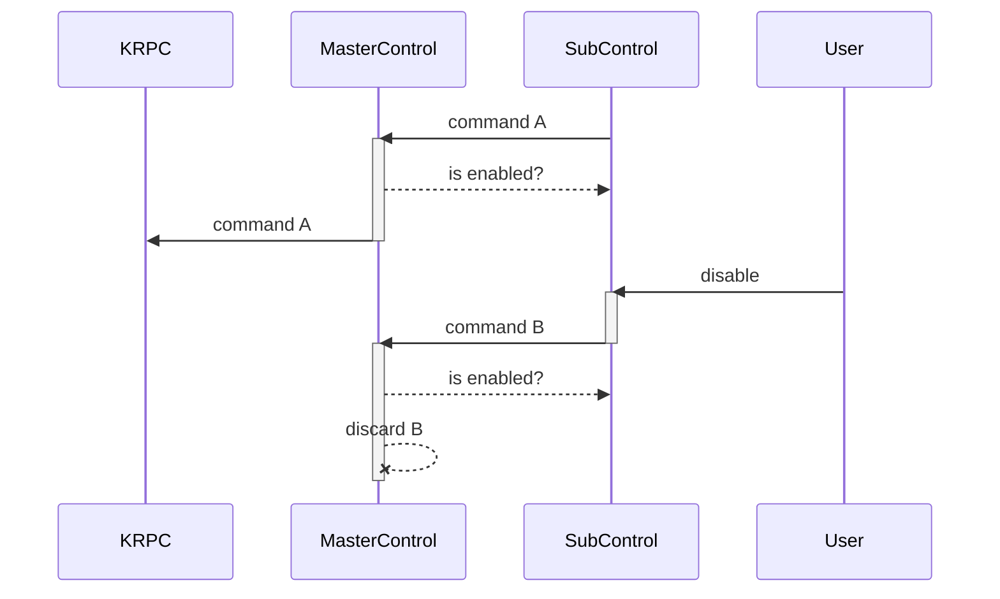

## The rogue loop problem

Let's say I am testing my rocket interactively. Since the test code is not reliable enough, it might fall into an infinite loop of sorts and I might not be able to stop it easily. However, the mission might still be salvageable. Instead of shutting down the whole program and starting over, I might be able to selectively turn off part of the control inputs, so that the rest of the program can continue working without interruption.

That's the problem this code is trying to solve.

Below is my thought process on how to create a new structure that addresses this issue.

1. No assumption on the rogue program's input generation part. I cannot easily stop it.
1. Therefore, a master controller should be able to "stop listening" to the rogue program.
1. Solution: Split the control input into several chains of Channels and add a flag that turns it on or off.

## MasterControl and SubControl

The solution can be summarized with a graph.



With addition of SubControl, I can manually or programmatically shut down control inputs. In Julia, this core logic looks like this:

```jl
function _transfer(
    from::Channel{T},
    to::Channel{T},
    toggle::Toggle=MutableToggle(true),
) where {T}
    while true
        value = take!(from)
        toggle.active && put!(to, value)
        yield()
    end
end
```

Julia's handy @async macro shines here. I don't need to worry about errors happening within the async block, but in my code I added a try-finally block to add some log messages.

```jl
struct SubControl <: AbstractControl
    ...
    function SubControl(
        name::String,
        sink::ControlChannel,
        toggle=MutableToggle(true),
        size::Integer=1
    )
        con = new(name, sink, toggle, create_control_channels(size)...)
        @async _transfer(con.engage, sink.engage, toggle, "$name/engage")
        @async _transfer(con.throttle, sink.throttle, toggle, "$name/throttle")
        @async _transfer(con.roll, sink.roll, toggle, "$name/roll")
        @async _transfer(con.direction, sink.direction, toggle, "$name/direction")
        @async _transfer(con.rcs, sink.rcs, toggle, "$name/rcs")
        return con
    end
end
```

## Usage cases

### Trajectory selector

This enables me to write simpler trajectory generation software, since I can start up several generators and then select one that makes the most sense. For example, I can start a roll program and a pitch program altogether (assuming that they don't rely on time since startup) and then toggle the inputs at the right time.

### Abort mode

Make MasterControl discard all incoming commands, so that KRPC will receive no signals from any SubControl. This can be useful in abort scenario, where I must discard any other rogue control inputs and directly plug abort trajectories through the hard-wired control channels.

### Manual override

If I need to take control of the spacecraft, ignoring all autopilot input, I can do it. It's like the early spacecrafts where the pilots learned how to fly the craft with a stick, not a computer!

## Making it easy to use

To make it integrate seamlessly, I changed the `Spacecraft` constructor to create a master control channel and automatically. Then I can derive a sub-control from the master control and use it. Here is an example of an abstract rocket program.

```jl
# create objects
sc = SpaceCenter("REPL", "127.0.0.1")
sp = add_active_vessel!(sc)
e1 = ... # some code to get an engine object
con = subcontrol(sp)

function begin_trajectory(sp::Spacecraft, con::SubControl)
    while con.toggle.active
        vec = do_advanced_math(...)
        put!(con.direction, vec |> vector_to_tuple)
        yield()
    end
end

# start trajectory generation that provide direction input continuously
@async begin_trajectory(sp, con)

# launch
put!(con.engage, true)
put!(con.throttle, 1.0)
ignite!(e1)
delay(sp.ts, 2)
stage!(sp)

# rocket start flying according to the trajectory.
wait(@async am_i_in_orbit(sp))
disable(con)

# mission accomplished
stage!(sp)
```
